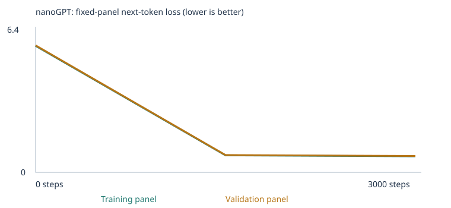
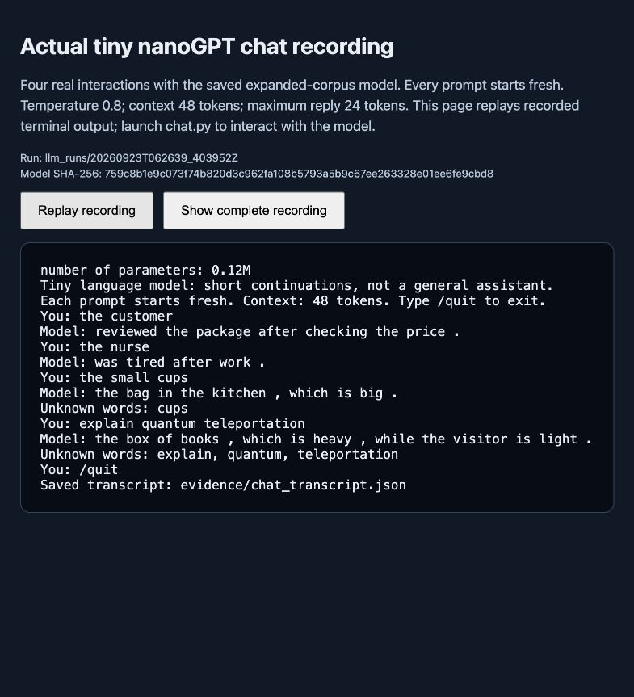

# Class 4: two executed custom-LLM experiments

Both fresh nanoGPT runs completed 3,000 updates. The starter scored **20/48 (41.67%)** after training; the expanded corpus scored **24/48 (50.00%)**. The expansion increased test vocabulary coverage, but **none of the 24 extension cases passed after training**. Its four additional correct answers came from the familiar-vocabulary `new_wording` category. The intended grammar/opposites transfer did not succeed on this benchmark. These are model measurements, not an assignment grade.

This repository contains actual executed notebooks, saved trained and untrained weights, all 192 case results, raw samples, and a recorded terminal session. Results below come from this project’s runs; upstream `examples/` and `legacy/` are teaching references and are not evidence for these experiments. Confidence is **high** in the recorded counts and outputs; **moderate** that the observed changes reflect learning narrow corpus patterns; **low** in any claim that adding these examples caused the improvement independently of initialization and split changes. No broad generalization claim is made.

## Evidence entry points

- [Machine-readable verification report](qa/audit.json) and [audit source](scripts/audit_artifacts.py): reconstruct training-only vocabularies, check splits and source hashes, replay every saved evaluation, verify notebook execution and ZIP contents. The [14 upstream tests](qa/course_tests.log) also passed, and the [documented evaluation CLI](qa/cli_eval_replay.log) reproduced the expanded score.

- **Starter**: [executed notebook](custom_llm.ipynb), [complete run folder](llm_runs/20260923T043154_967139Z/), [results ZIP](llm_runs/20260923T043154_967139Z.zip). Run ID: `20260923T043154_967139Z`.

- **Expanded**: [executed notebook](custom_llm_expanded.ipynb), [complete run folder](llm_runs/20260923T062639_403952Z/), [results ZIP](llm_runs/20260923T062639_403952Z.zip). Run ID: `20260923T062639_403952Z`.

- [Detailed learning evidence](docs/learning_evidence.md): complete 64-coordinate before/after vectors, gradients, probabilities, all timeline and temperature samples, and case-by-case score changes.

- [Actual terminal recording](evidence/chat_recording.html), [recording source](evidence/chat.cast), [terminal text](evidence/chat_terminal.txt), and [chat transcript](evidence/chat_transcript.json). Download/open the HTML locally to play it if GitHub shows its source.

- [Prediction recorded before training](docs/pretraining_plan.md), [corpus rationale and provenance](docs/corpus_design.md), [execution ledger](experiment_runs.json), and [original assignment](ASSIGNMENT.md).

## What was chosen and why

**Corpus:** first the supplied synthetic classroom corpus with no added files, then the same classroom generator plus focused **grammar** and **opposites** teaching material. The starter repeats domain associations; the expansion was intended to add subject/verb agreement, tense, and contextual contrasts. The [deterministic generator](scripts/build_extension_corpus.py) created 528 grammar passages and 384 contextual contrast passages, and the executed manifest confirms all **912 unique additions**. They use different roles, situations, and wording from the test stories. They are varied templates, not 912 independent underlying situations.

**Training budget:** 3,000 optimizer steps per fresh model, batch size 32, the suggested course starting budget. One step updates weights from a minibatch; it is not a complete corpus pass. **Learning rate:** 0.001 as the configured peak, with the supplied 100-step warmup and cosine decay. The first effective rate is 0.00001. Excessively large updates could destabilize the loss; very small ones could make too little progress within 3,000 steps. These are assistant-proposed choices recorded before execution, not an invented personal response from the student.

The model has 2 transformer blocks, 4 attention heads, 64-dimensional embeddings, a 48-token context, and seed 42. Training ran locally on CPU; saved hardware is `macOS-26.6.2-arm64-arm-64bit`, Python 3.12.14 and PyTorch 2.14.0. No GPU or external model API supplied the generated replies. The unchanged nanoGPT source is pinned to [Karpathy commit 3adf61e](https://github.com/karpathy/nanoGPT/blob/3adf61e154c3fe3fca428ad6bc3818b27a3b8291/model.py), with its [MIT license](NANOGPT_LICENSE). Whole-word tokenization and teaching/evaluation helpers come from the [course project](https://github.com/pepealonso95/custom-llm).

## Corpus, permissions, and experimental controls

The starter text is generated by the supplied course code. The two added UTF-8 TXT files are original synthetic examples created with Codex assistance for this project; no private records, scraped passages, or third-party source documents were added. They may be shared with this project; commonplace sentences are not claimed as exclusive intellectual property. Source files: [grammar](corpus/expanded/grammar_practice.txt) and [contextual contrasts](corpus/expanded/contextual_contrasts.txt). Source hashes, previews, and passage counts are saved in the manifests. No PDFs were used, so OCR, page extraction, and PDF reading-order checks were not applicable. Both imported files have empty warning lists, and no files were ignored.

| Measurement | Starter | Expanded |
|---|---:|---:|
| Unique passages | 4592 | 5504 |
| Added unique passages | 0 | 912 |
| Training / validation passages | 4132 / 460 | 4953 / 551 |
| Vocabulary including UNK/BOS/EOS | 136 | 319 |
| Retained ordinary token types | 133 | 316 |
| Training / held-out token UNK rate | 0.00% / 0.00% | 0.00% / 0.00% |
| Parameters | 111,872 | 123,584 |
| Completed optimizer steps | 3000 | 3000 |
| Training-loop elapsed seconds | 9.063363 | 13.797743 |
| Full notebook wall seconds | 20.248840 | 18.271616 |
| Interrupted | No | No |

Both runs remove 160 generated passages containing reserved test prefixes and remove 1,608 duplicate passages, then use a 90/10 split of unique passages. The vocabulary is built only from the training split (maximum 509 ordinary types plus three special tokens). No token types were omitted in these runs. A zero held-out UNK rate describes the corpus split; it does not mean complete coverage of the separate eval suite.

Within each run, the vocabulary, train/validation split, fixed loss panels, seed and baseline generation settings are unchanged before/after training. Across the two fresh runs, adding passages changes split membership and panels; changing vocabulary changes token IDs, embedding/output dimensions, parameter counts, and random initialization even with seed 42. Thus this is an informative development comparison, not an exact paired causal experiment. The two loss scales also refer to different vocabularies and data, so their absolute values should not rank the models.

**Starter audit links:** [config.json](llm_runs/20260923T043154_967139Z/config.json) · [corpus_manifest.json](llm_runs/20260923T043154_967139Z/corpus_manifest.json) · [vocabulary_report.json](llm_runs/20260923T043154_967139Z/vocabulary_report.json) · [split.json](llm_runs/20260923T043154_967139Z/split.json) · [corpus.txt](llm_runs/20260923T043154_967139Z/corpus.txt) · [tokenization.json](llm_runs/20260923T043154_967139Z/tokenization.json) · [training_summary.json](llm_runs/20260923T043154_967139Z/training_summary.json) · [eval_separation.json](llm_runs/20260923T043154_967139Z/eval_separation.json)

**Expanded audit links:** [config.json](llm_runs/20260923T062639_403952Z/config.json) · [corpus_manifest.json](llm_runs/20260923T062639_403952Z/corpus_manifest.json) · [vocabulary_report.json](llm_runs/20260923T062639_403952Z/vocabulary_report.json) · [split.json](llm_runs/20260923T062639_403952Z/split.json) · [corpus.txt](llm_runs/20260923T062639_403952Z/corpus.txt) · [tokenization.json](llm_runs/20260923T062639_403952Z/tokenization.json) · [training_summary.json](llm_runs/20260923T062639_403952Z/training_summary.json) · [eval_separation.json](llm_runs/20260923T062639_403952Z/eval_separation.json)

## Before training: prediction; after training: observation

The [pretraining plan](docs/pretraining_plan.md) predicted, with moderate confidence, falling training and held-out panel loss and increasingly corpus-like text. Those predictions were observed within both runs. It also predicted only low-to-moderate confidence of grammar/opposites improvement. That prediction was not supported: coverage expanded by three cases, but the expanded trained model missed all three newly scorable extension cases. One grammar and one opposites case were correct in its random untrained state and became incorrect after training; chance-correct initialization is not evidence of understanding.

The plan suggested that `customer` could become more similar to buyer-related nouns, without predicting their ordering. The full-vector evidence reports the actual nearest neighbors rather than treating a 3D picture as proof of meaning. Successful domain templates and lower loss coexist with malformed text and failed transfer.

## All four complete evaluation result sets

The unchanged suite has 16 starter-pattern cases, 8 familiar-vocabulary new phrasings, and 24 extension challenges. The runner supplies only each prefix to the model, then scores whether the correct next word has uniquely highest probability **among four choices**. It does not append the choices or key to the prompt and does not update weights. Ties receive zero. A case is unscorable if required prompt/choice vocabulary is missing or its context is too long; it remains in the 48-case denominator with zero credit. Scorable accuracy is correct/scorable; coverage is scorable/total. `N/A` means no scorable cases, not zero-percent measured accuracy. The free continuation is separately sampled and is not the scored answer.

| Experiment / stage | Correct / all | All-case success | Scorable | Scorable accuracy | Coverage | Complete evidence |
|---|---:|---:|---:|---:|---:|---|
| Starter / untrained | 9/48 | 18.75% | 24 | 37.50% | 50.00% | [JSON](llm_runs/20260923T043154_967139Z/language_evals/untrained/eval_results.json) · [CSV](llm_runs/20260923T043154_967139Z/language_evals/untrained/eval_results.csv) · [summary](llm_runs/20260923T043154_967139Z/language_evals/untrained/eval_summary.json) · [cases](llm_runs/20260923T043154_967139Z/language_evals/untrained/eval_cases.json) |
| Starter / final | 20/48 | 41.67% | 24 | 83.33% | 50.00% | [JSON](llm_runs/20260923T043154_967139Z/language_evals/final/eval_results.json) · [CSV](llm_runs/20260923T043154_967139Z/language_evals/final/eval_results.csv) · [summary](llm_runs/20260923T043154_967139Z/language_evals/final/eval_summary.json) · [cases](llm_runs/20260923T043154_967139Z/language_evals/final/eval_cases.json) |
| Expanded / untrained | 9/48 | 18.75% | 27 | 33.33% | 56.25% | [JSON](llm_runs/20260923T062639_403952Z/language_evals/untrained/eval_results.json) · [CSV](llm_runs/20260923T062639_403952Z/language_evals/untrained/eval_results.csv) · [summary](llm_runs/20260923T062639_403952Z/language_evals/untrained/eval_summary.json) · [cases](llm_runs/20260923T062639_403952Z/language_evals/untrained/eval_cases.json) |
| Expanded / final | 24/48 | 50.00% | 27 | 88.89% | 56.25% | [JSON](llm_runs/20260923T062639_403952Z/language_evals/final/eval_results.json) · [CSV](llm_runs/20260923T062639_403952Z/language_evals/final/eval_results.csv) · [summary](llm_runs/20260923T062639_403952Z/language_evals/final/eval_summary.json) · [cases](llm_runs/20260923T062639_403952Z/language_evals/final/eval_cases.json) |

Every case is retained, including failures and unknown-word cases. The suite SHA-256 recorded in all stages is `1d7c503f34d88260d0ac897bc36b8ba621cccc1950aef47e7121e69b2c1c9e1d`. Each run’s separation record confirms 160 generated passages excluded. The check is normalized contiguous-prefix detection, **not** a semantic-leakage detector. The source generator, eval suite, transcripts and result directories remain separate; the corpus folder is explicitly `corpus/starter` or `corpus/expanded`, never the project root. The public benchmark informed the category choices, so it is a development benchmark, not an untouched test of generalization.

The following tables report **correct/total (all-case success); scorable/total (coverage); scorable accuracy** in each cell.

### Group results

| Group or category | Starter untrained | Starter trained | Expanded untrained | Expanded trained |
|---|---|---|---|---|
| extend_corpus | 0/24 (0.00%); 0/24 (0.00%); N/A | 0/24 (0.00%); 0/24 (0.00%); N/A | 2/24 (8.33%); 3/24 (12.50%); 66.67% | 0/24 (0.00%); 3/24 (12.50%); 0.00% |
| starter_patterns | 6/16 (37.50%); 16/16 (100.00%); 37.50% | 16/16 (100.00%); 16/16 (100.00%); 100.00% | 4/16 (25.00%); 16/16 (100.00%); 25.00% | 16/16 (100.00%); 16/16 (100.00%); 100.00% |
| starter_transfer | 3/8 (37.50%); 8/8 (100.00%); 37.50% | 4/8 (50.00%); 8/8 (100.00%); 50.00% | 3/8 (37.50%); 8/8 (100.00%); 37.50% | 8/8 (100.00%); 8/8 (100.00%); 100.00% |

### Category results

| Group or category | Starter untrained | Starter trained | Expanded untrained | Expanded trained |
|---|---|---|---|---|
| categories_and_analogies | 0/3 (0.00%); 0/3 (0.00%); N/A | 0/3 (0.00%); 0/3 (0.00%); N/A | 0/3 (0.00%); 0/3 (0.00%); N/A | 0/3 (0.00%); 0/3 (0.00%); N/A |
| domain_context | 3/8 (37.50%); 8/8 (100.00%); 37.50% | 8/8 (100.00%); 8/8 (100.00%); 100.00% | 2/8 (25.00%); 8/8 (100.00%); 25.00% | 8/8 (100.00%); 8/8 (100.00%); 100.00% |
| domain_place | 3/8 (37.50%); 8/8 (100.00%); 37.50% | 8/8 (100.00%); 8/8 (100.00%); 100.00% | 2/8 (25.00%); 8/8 (100.00%); 25.00% | 8/8 (100.00%); 8/8 (100.00%); 100.00% |
| everyday_knowledge | 0/3 (0.00%); 0/3 (0.00%); N/A | 0/3 (0.00%); 0/3 (0.00%); N/A | 0/3 (0.00%); 0/3 (0.00%); N/A | 0/3 (0.00%); 0/3 (0.00%); N/A |
| grammar | 0/3 (0.00%); 0/3 (0.00%); N/A | 0/3 (0.00%); 0/3 (0.00%); N/A | 1/3 (33.33%); 1/3 (33.33%); 100.00% | 0/3 (0.00%); 1/3 (33.33%); 0.00% |
| negation | 0/3 (0.00%); 0/3 (0.00%); N/A | 0/3 (0.00%); 0/3 (0.00%); N/A | 0/3 (0.00%); 0/3 (0.00%); N/A | 0/3 (0.00%); 0/3 (0.00%); N/A |
| new_wording | 3/8 (37.50%); 8/8 (100.00%); 37.50% | 4/8 (50.00%); 8/8 (100.00%); 50.00% | 3/8 (37.50%); 8/8 (100.00%); 37.50% | 8/8 (100.00%); 8/8 (100.00%); 100.00% |
| opposites | 0/3 (0.00%); 0/3 (0.00%); N/A | 0/3 (0.00%); 0/3 (0.00%); N/A | 1/3 (33.33%); 2/3 (66.67%); 50.00% | 0/3 (0.00%); 2/3 (66.67%); 0.00% |
| reference | 0/3 (0.00%); 0/3 (0.00%); N/A | 0/3 (0.00%); 0/3 (0.00%); N/A | 0/3 (0.00%); 0/3 (0.00%); N/A | 0/3 (0.00%); 0/3 (0.00%); N/A |
| sequence | 0/3 (0.00%); 0/3 (0.00%); N/A | 0/3 (0.00%); 0/3 (0.00%); N/A | 0/3 (0.00%); 0/3 (0.00%); N/A | 0/3 (0.00%); 0/3 (0.00%); N/A |
| spatial_relations | 0/3 (0.00%); 0/3 (0.00%); N/A | 0/3 (0.00%); 0/3 (0.00%); N/A | 0/3 (0.00%); 0/3 (0.00%); N/A | 0/3 (0.00%); 0/3 (0.00%); N/A |

### What improved and what failed

The trained-to-trained gains are exactly `lang_18`, `lang_19`, `lang_22`, and `lang_23`; no starter-trained correct case became incorrect in the expanded-trained model. All four were already scorable in the starter, so the additional four correct answers are not simply newly counted vocabulary coverage. However, the model initialization and split also changed, so a single pair of runs does not isolate why these four improved. The extension group went from 0/24 to 0/24 after training despite coverage increasing from 0/24 to 3/24. Within the expanded run, extension accuracy actually fell from 2/3 to 0/3 scorable cases.

| Concrete case | Expanded trained outcome | Interpretation |
|---|---|---|
| `lang_27`: `yesterday she`; expected `walked` | Choice: `walk`; status `scored`; unknown words: none. Continuation: `happy before work .` | All required words were known; the tense pattern failed. |
| `lang_28`: `the opposite of hot is`; expected `cold` | Choice: `heavy`; status `scored`; unknown words: none. Continuation: `river and the orange near the fruit was heavy .` | Contrast vocabulary was present, but transfer to this question form failed. |
| `lang_29`: `the opposite of empty is`; expected `full` | Choice: `soft`; status `scored`; unknown words: none. Continuation: `is late , but the sound of the window was voice was soft .` | Coverage alone did not yield the tested opposite relation. |
| `lang_25`: `one bird`; expected `is` | Choice: `None`; status `out_of_vocabulary`; unknown words: bird, one. Continuation: `the different consumer yesterday .` | Missing prompt vocabulary prevents a valid four-choice score. |
| `lang_30`: `the opposite of noisy is`; expected `quiet` | Choice: `None`; status `out_of_vocabulary`; unknown words: round. Continuation: `were calm after checking the small , but the room by the garden was quiet .` | A missing distractor also makes a case unscorable; it is not dropped. |

A correct choice need not be the free continuation. For starter-trained `lang_03`, the highest-probability offered choice was `payment` (0.257614), but the sampled continuation was `return in detail .`. For expanded-trained `lang_19`, the correct offered choice was `return`, while free generation was `interest .`. Neither result proves that unrestricted generation reliably produces the expected answer.

## Full fixed-panel loss measurements

Each row is the mean cross-entropy over all non-padding next-token targets in the same fixed **20 training passages and 20 validation passages** within that run. These are small panels, not full-corpus measurements. Lower loss means the model assigned more probability to the observed next tokens; it is not an accuracy percentage.

| Experiment | Step | Training loss | Validation loss |
|---|---:|---:|---:|
| Starter | 0 | 4.926252365112305 | 4.927547931671143 |
| Starter | 1500 | 0.6821381449699402 | 0.7182430624961853 |
| Starter | 3000 | 0.6783124208450317 | 0.7061358690261841 |
| Expanded | 0 | 5.781627655029297 | 5.803586006164551 |
| Expanded | 1500 | 0.7778765559196472 | 0.7909225821495056 |
| Expanded | 3000 | 0.7322326302528381 | 0.7467306852340698 |

**Starter:** [full CSV](llm_runs/20260923T043154_967139Z/training.csv) · [raw values](llm_runs/20260923T043154_967139Z/history.json)


**Expanded:** [full CSV](llm_runs/20260923T062639_403952Z/training.csv) · [raw values](llm_runs/20260923T062639_403952Z/history.json)



Both held-out panel losses fell along with training loss. This supports learning on closely related synthetic templates; the passage split allows related frames and source files on both sides. It does not establish generalization to new templates, domains or documents. The expanded final sample `last week the musicians low .` is worse than its halfway sample `last week the musicians walked through the park .`, even though panel loss improved. Four saved samples are too few to estimate a general fluency rate.

All four samples at each of steps 0, 1,500 and 3,000 are shown unedited in [learning evidence](docs/learning_evidence.md). Baseline settings are BOS start, temperature 0.8, seed 2026 and at most 32 generated tokens, with EOS stopping. Nothing was omitted because it was garbled. All 12 temperature samples per run are also preserved. At each temperature the generator resets to the same seed and BOS start; because sampled length changes random-number consumption, later samples are matched by generator setup, not guaranteed identical per-token random draws.

**Starter sample links:** [samples/step_0000.txt](llm_runs/20260923T043154_967139Z/samples/step_0000.txt) · [samples/step_1500.txt](llm_runs/20260923T043154_967139Z/samples/step_1500.txt) · [samples/step_3000.txt](llm_runs/20260923T043154_967139Z/samples/step_3000.txt) · [temperature_comparison.json](llm_runs/20260923T043154_967139Z/temperature_comparison.json)

**Expanded sample links:** [samples/step_0000.txt](llm_runs/20260923T062639_403952Z/samples/step_0000.txt) · [samples/step_1500.txt](llm_runs/20260923T062639_403952Z/samples/step_1500.txt) · [samples/step_3000.txt](llm_runs/20260923T062639_403952Z/samples/step_3000.txt) · [temperature_comparison.json](llm_runs/20260923T062639_403952Z/temperature_comparison.json)

## How the model learned, using actual evidence

A **corpus** is the teaching text. **Tokens** here are lowercase words and punctuation, with BOS/EOS marking boundaries and UNK for missing types. An **ID** is an arbitrary vocabulary index, not a semantic rank. In the starter, `customer` is ID 28; in the expanded run it is ID 62 because the vocabulary changed. Each ID selects a learned **64-number embedding vector**. These lookup vectors combine with position embeddings and pass through the network’s learned attention and feed-forward weights; hidden representations become context-dependent. A coordinate is not a named concept.

The starter’s `customer` coordinate 0 began at **−0.057591915130615234**, had a saved first-step gradient **0.000692586530931294**, and changed to **−0.05760190635919571** after the first update at effective learning rate **0.00001**. After 3,000 updates it was **0.0366341732442379**. The gradient measures local sensitivity of minibatch loss to that weight, not a semantic instruction. The recorded gradient is before global-norm clipping. AdamW uses moving averages of gradients and squared gradients, bias correction, and decoupled weight decay; therefore this change is not simply `−learning_rate × saved_gradient`. The supplied optimizer uses betas (0.9, 0.95), weight decay 0.01 and clipping at global norm 1.0. Full vectors and the expanded update are in [learning evidence](docs/learning_evidence.md).

The neural network contains trainable embedding and linear-transformation weights, nonlinear GELU feed-forward layers, layer normalization, and residual connections. Input and output token-embedding weights are tied. Training predicts each next token from previous tokens. Cross-entropy penalizes assigning low probability to the actual next token. PyTorch backpropagation calculates gradients through the network, and AdamW updates its weights. Repeating this process changed the starter next-token distribution after `the customer`: plausible corpus verbs receive substantial probability after training, while the initial distribution was diffuse. The detailed evidence gives actual probability tables and the complete distribution is saved in `inspection.json`. These are probabilities of next tokens, not confidence that a generated sentence is factually true.

Attention forms learned queries, keys and values, compares queries with earlier keys, normalizes the scores and combines value vectors. The causal mask prohibits looking ahead. For the starter’s trained first layer/head on `[BOS, the, customer]`, the last attention row is **[0.485155, 0.423004, 0.091841]**. The first row is [1, 0, 0] and the second has zero in the future position, making masking visible. This one head’s weights do not fully explain a prediction; other heads, layers and the feed-forward path also contribute.

Generation converts logits to probabilities and samples a token, appends it to context and repeats. Temperature uses `softmax(logits / T)` without changing any learned weights. Lower temperature concentrates mass on likely tokens; higher temperature flattens it. Here 0.3, 0.8 and 1.2 were compared with the same starting token and seed. Some outputs stayed identical: the starter’s first sample is the same at all three settings. In the expanded run, 0.8 produced `last week the musicians low .`; 1.2 produced other corpus-like examples. This small sample is not evidence that higher temperature is generally more grammatical.

## Working chat and exact launch instructions

The supplied [chat.py](chat.py) loads the expanded run’s actual `model.pt` and saved vocabulary, then repeatedly accepts input. Every prompt starts fresh; there is no conversation memory or training during chat. It reports unknown words and truncates long prompts to the most recent context. The interface has a 48-token context and generates up to 24 new tokens at temperature 0.8. `checkpoint.json` is for the embedding viewer, not the full inference model.

From the repository root, use Python 3.12. The lock file reproduces the recorded dependency versions; it was generated on macOS. Use the same Python environment when selecting a VS Code/Jupyter notebook kernel. A full Jupyter GUI is optional: the included nbclient execution script runs notebooks directly.

```sh
python3.12 -m venv .venv
source .venv/bin/activate
python -m pip install -r requirements-lock.txt
python -m ipykernel install --prefix .venv --name python3 --display-name "Custom LLM (Python 3.12)"
```

Open [custom_llm.ipynb](custom_llm.ipynb) or [custom_llm_expanded.ipynb](custom_llm_expanded.ipynb) in VS Code/Jupyter, select that environment, and use Run All. To execute fresh experiments programmatically, the script uses the supplied source notebook and preserves all real cell outputs; it overwrites the executed notebook and updates the ledger while retaining timestamped run folders, so keep a copy of submitted evidence before rerunning:

```sh
python scripts/execute_experiment.py starter
python scripts/build_extension_corpus.py --check
python scripts/build_extension_corpus.py
python scripts/execute_experiment.py expanded
```

The two submitted models are already included in their run folders and ZIPs, so training is not required to replay evaluation or chat. Use a new output/transcript name when preserving earlier evidence:

```sh
python run_evals.py --model llm_runs/20260923T043154_967139Z/model_untrained.pt --output results/starter-untrained
python run_evals.py --model llm_runs/20260923T043154_967139Z/model.pt --output results/starter-final
python run_evals.py --model llm_runs/20260923T062639_403952Z/model_untrained.pt --output results/expanded-untrained
python run_evals.py --model llm_runs/20260923T062639_403952Z/model.pt --output results/expanded-final
python chat.py --model llm_runs/20260923T062639_403952Z/model.pt --transcript results/new-chat.json
```

The recorded terminal session used expanded run `20260923T062639_403952Z`, 3,000 completed steps, and model-state hash `759c8b1e9c073f74b820d3c962fa108b5793a5b9c67ee263328e01ee6fe9cbd8`. These were actual inputs and outputs; the assistant scripted the demonstration rather than claiming the student personally typed it.

| Input | Actual model continuation | Unknown words |
|---|---|---|
| `the customer` | `reviewed the package after checking the price .` | None |
| `the nurse` | `was tired after work .` | None |
| `the small cups` | `the bag in the kitchen , which is big .` | cups |
| `explain quantum teleportation` | `the box of books , which is heavy , while the visitor is light .` | explain, quantum, teleportation |

The quantum prompt demonstrates the limitation: all three words were unknown and the model emitted an unrelated corpus-style continuation. It has no mechanism for explaining quantum teleportation. The cups prompt also fails coherently because `cups` is outside the vocabulary. [Replay the recording](evidence/chat_recording.html) and inspect the [saved transcript](evidence/chat_transcript.json), which records seeds and truncation flags.



The image above is a screenshot of the actual terminal recording replay. [Reproduction and review notes](docs/reproduction_notes.md) explain how the execution and derived artifacts were prepared.

## Limitation, next experiment, and assistance disclosure

The most consequential result is that adding grammar and contrast sentences improved corpus loss and vocabulary coverage without passing the targeted extension tests. The teaching examples may not transfer to the test’s tense and “opposite of” forms. That explanation is a hypothesis, not a proven cause. The corpus also contains five mechanically generated phrases of the form `a artist seems ...`, an article-agreement error found during review. Those mistakes are disclosed and preserved in the executed experiment; silently correcting the source would make it inconsistent with the saved trained weights.

The next experiment should first correct those five article errors and audit agreement/tense in the generated material, then run fresh models while holding data constant across multiple initialization seeds to estimate variability. A separate, newly designed suite of grammatical and contrast tasks should be frozen before further corpus revision, with unseen situations and phrasing. An ablation can then change only one teaching category at a time while keeping an anchored shared evaluation set and reporting vocabulary coverage. Longer training alone cannot supply missing words, and selecting examples to match this public benchmark would not establish unseen generalization.

Codex helped design and generate the extension corpus, execute the notebooks and chat demonstration, inspect saved evidence, audit results, and write this report. The core model and classroom pipeline are attributed above. All numeric results and quoted model outputs are saved artifacts; no student-authored reflection, independent understanding, or portal submission is claimed. The report is intended to be reviewed alongside the notebook so the student can explain what was measured, what failed, and what remains uncertain.

## Actual embedding viewers

Open the [starter viewer](evidence/embeddings_starter.html) or [expanded viewer](evidence/embeddings_expanded.html) locally. Each embeds its actual recorded checkpoint, so no file picker is required. The expanded viewer’s shared 3D PCA projection retains only 22.2% of pooled variance; the displayed neighbor rankings use all 64 dimensions. Its customer neighbors changed from traffic, chair and waiting before training to subscriber, client and shopper afterward. This is evidence about narrow learned distributional contexts, not an independently validated semantic map.


