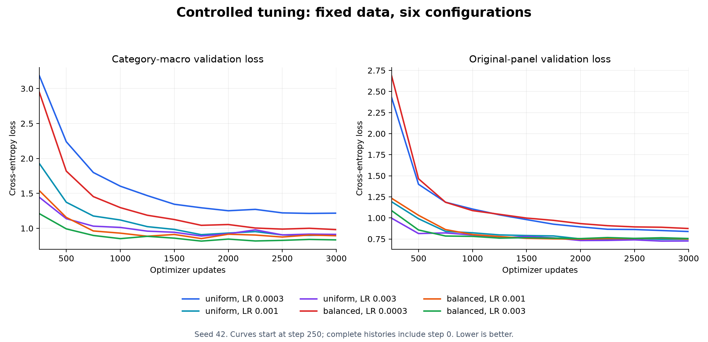

# Controlled tuning: an initial gain that failed confirmation

Balanced sampling with peak learning rate **0.003** improved the seed-42 run from **24/48 to 26/48**. Its category-macro validation loss fell **7.99%**. The two additional initialization seeds failed to confirm that optimization benefit: validation loss increased in both, while benchmark scores tied once and declined once. Keep the baseline settings as the default until a further controlled study establishes a consistent gain.

**Confidence:** high in the saved measurements and exact replays; low in a general performance advantage for the selected configuration.

## The comparison

- Study: `20260923T065432_482471Z`. [Executed notebook](../custom_llm_tuning.ipynb), [frozen protocol](../tuning_runs/20260923T065432_482471Z/protocol.json), [full report](../tuning_runs/20260923T065432_482471Z/REPORT.md), [CSV](../tuning_runs/20260923T065432_482471Z/results.csv), [run ledger](../tuning_runs/20260923T065432_482471Z/ledger.json).
- Fixed: expanded corpus, 319-token vocabulary, split, architecture, 3,000 updates, batch size 32, AdamW schedule, and minibatches within each sampling method.
- Uniform sampling used all training passages equally. Balanced sampling used exactly 16 starter, eight grammar, and eight contrast passages per batch.
- Selection used the mean of three category losses from a fixed held-out panel: ten starter, five grammar, five contrast passages. The original validation panel supplied a 5% loss guardrail.
- Seed 42 selected the setting. Seeds 43 and 44 changed **initial weights only**; both minibatch schedules remained fixed. Language-evaluation scores were read after selection and confirmation.

| Sampler | Peak LR | Category-macro loss | Original-panel loss | Guardrail | Correct / 48 |
|---|---:|---:|---:|---|---:|
| Uniform | 0.0003 | 1.216935 | 0.838709 | Fail | 24 |
| Uniform, baseline | 0.001 | 0.906704 | 0.746731 | Pass | 24 |
| Uniform | 0.003 | 0.913143 | 0.726566 | Pass | 24 |
| Balanced | 0.0003 | 0.981257 | 0.874261 | Fail | 25 |
| Balanced | 0.001 | 0.893670 | 0.749250 | Pass | 26 |
| Balanced, selected | 0.003 | 0.834300 | 0.755719 | Pass | 26 |

The selected seed-42 checkpoint fixed `lang_28` and `lang_29`, both opposites cases, while retaining all 24 previously correct answers. Vocabulary coverage remained **27/48** for every configuration.

| Initialization seed | Baseline score | Selected score | Change in macro loss | Interpretation |
|---|---:|---:|---:|---|
| 42, selection | 24/48 | 26/48 | −0.072404 | Initial improvement |
| 43, confirmation | 25/48 | 25/48 | +0.051777 | Worse loss; one case gained and one lost |
| 44, confirmation | 26/48 | 25/48 | +0.027321 | Worse loss; one case lost |

Confirmation-only average scores were **25.5/48 for baseline** and **25.0/48 for selected**. The three-seed average of 25.0 versus 25.33 includes the seed used to choose the configuration. All three pairs passed the original-panel guardrail. [Every paired case change](../tuning_runs/20260923T065432_482471Z/paired_results.json).

Grammar-panel loss improved across all three seeds. Contrast-panel loss improved at seed 42 and worsened at seeds 43 and 44. This identifies contrasts as a useful focus for the next data and sampling experiment.



## One actual optimizer update

The example was selected before training from the scheduled minibatch at update **1,000** of the selected seed-42 run:

```text
Training passage: a gardener seems calm today .
Prediction:       a gardener → seems
Parameter:        shared input/output embedding, token 225, coordinate 0
```

| Measurement | Before | After |
|---|---:|---:|
| Training minibatch loss | 0.652824819 | 0.640562475 |
| Category-macro validation loss | 0.853395243 | 0.852127512 |
| Original-panel validation loss | 0.780086398 | 0.781157315 |
| Probability of `seems` | 0.992850184 | 0.992580414 |
| Embedding coordinate | −0.206000313 | −0.205368862 |

- Effective learning rate: **0.00240881256**. Actual coordinate change: **+0.000631451607**.
- Raw and clipped gradient: **−0.000110582019**. The gradient norm was **0.443407834**, below the clipping threshold of 1.
- First moment: **−0.000023119341 → −0.000031865609**. Second moment: **0.000000015155386 → 0.000000015009036**.
- AdamW uses moving averages, bias correction, adaptive scaling, and weight decay. The equation and complete 64-coordinate evidence are in the [full report](../tuning_runs/20260923T065432_482471Z/REPORT.md) and [update record](../tuning_runs/20260923T065432_482471Z/balanced_lr0.003_seed42/gradient_update.json).

The step improved average fit to its training minibatch and the category panel. The selected target probability and original-panel loss moved slightly in the unfavorable direction. All model weights changed together, so the single coordinate illustrates the update without isolating its causal contribution.

## What to improve next

1. **Broaden teaching vocabulary.** Twenty-one cases are unscorable with the current vocabulary. Independently designed teaching material can raise coverage; accuracy on those cases must then be measured. Confidence in the coverage constraint is **high**.
2. **Review and diversify the data.** Correct the five `a artist` examples in a new corpus version. Add varied grammar and contrast constructions, then test withheld template families. Confidence in better transfer is **moderate**.
3. **Separate the sampling changes.** Grammar improved consistently; contrasts were sensitive to initialization. Compare grammar and contrast exposure separately while retaining fixed data and initialization controls.
4. **Use broader confirmation.** Cross several initialization seeds with several minibatch seeds, and retain a separate final evaluation set. This study isolates initialization; the separately documented forked study also changes minibatch seeds.
5. **Prioritize data before extra compute.** Selected-run macro losses fluctuate late in training. The observed curves give little support for simply extending training. Consider larger models or tokenization changes after measuring the preceding changes and checking course constraints.

## Verification and reproduction

**96 checks passed.** The original expanded baseline was reproduced bit for bit. Every final evaluation and every recorded update was replayed exactly. Instrumented and uninstrumented selected runs ended with identical weights and validation histories. The original tracked files were unchanged at verification time. [Audit](../tuning_runs/20260923T065432_482471Z/audit.json).

The study contains six screening runs, four confirmation runs, and one instrumentation control. Small validation panels share templates with training, so these results support narrow corpus conclusions. The unchanged 48-case suite remains a public development benchmark.

From the repository root, using the existing project environment:

```sh
uv pip install --python .venv/bin/python nbformat nbclient ipykernel matplotlib
.venv/bin/python scripts/execute_tuning.py
```

The launcher regenerates the supplemental notebook and creates a fresh timestamped study directory. It preserves prior study folders and the two original assignment notebooks. The notebook requires a `python3` kernel registered to the project environment. For a fresh environment, register it with:

```sh
.venv/bin/python -m ipykernel install --user --name python3 --display-name "Python 3"
```

Regenerate the exportable figure from this study without retraining:

```sh
.venv/bin/python scripts/plot_tuning.py tuning_runs/20260923T065432_482471Z
```

[SVG figure](../tuning_runs/20260923T065432_482471Z/curves_matplotlib.svg) · [Training implementation](../scripts/tuning_study.py) · [Executed-source snapshot](../tuning_runs/20260923T065432_482471Z/training_source.py) · [Selected model](../tuning_runs/20260923T065432_482471Z/balanced_lr0.003_seed42/model.pt).
