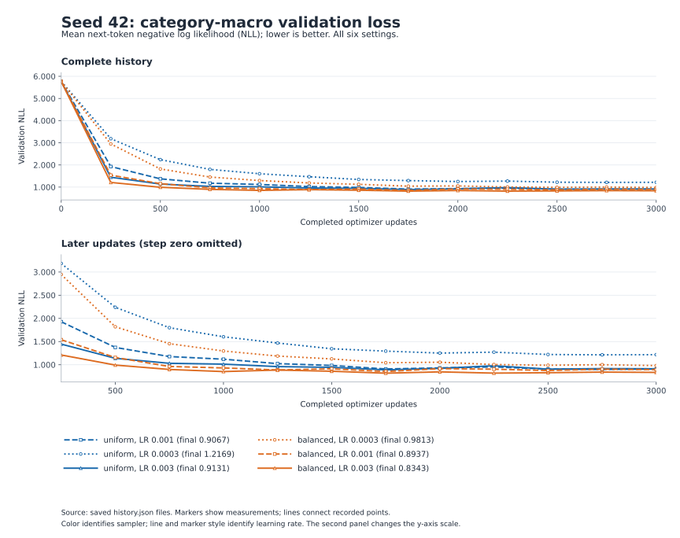
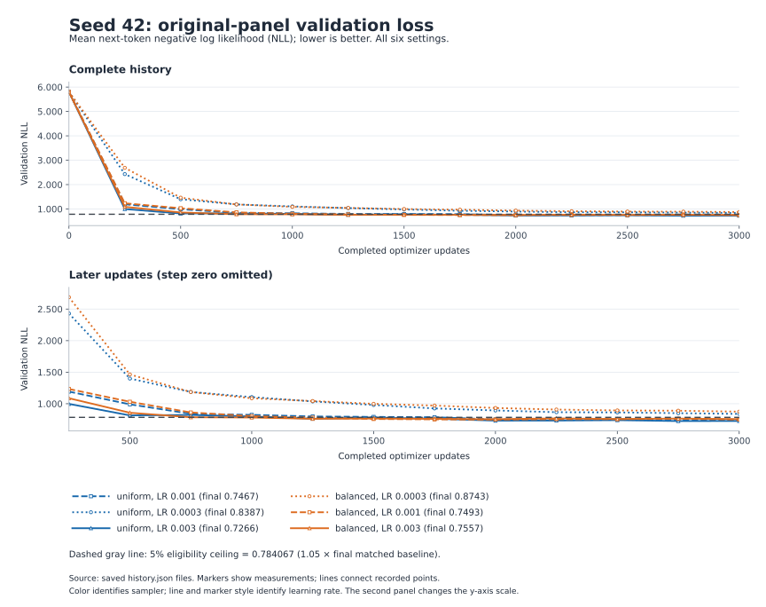

# Controlled learning-rate and sampling study

Validation selected **balanced sampling, peak learning rate 0.003**. At seed 42, macro validation NLL changed from **0.906704 to 0.834300** (-7.99%). Original-panel NLL changed from **0.746731 to 0.755719** (+1.20%), within the 5% guardrail. The public development benchmark changed from **24/48 to 26/48**. Across 3 paired seeds, mean correct answers changed from **25.00 to 26.33**; the mean paired change was **+1.33 cases**.

The selected setting remains an **exploratory candidate**. Its positive confirmation results did not replicate when initialization changed while minibatch schedules stayed fixed; retain the baseline until crossed initialization and sampler seeds plus template-family holdouts establish robustness. Confidence is **high** in the saved measurements and replay checks, **low** in a robust advantage across seed protocols, and **low** in broader language generalization. These scores are experimental measurements; no official grade is inferred.

Evidence: [frozen plan](../tuning_runs/20260923T065357_257422Z/preregistered_plan.json) · [selection](../tuning_runs/20260923T065357_257422Z/selection.json) · [run ledger](../tuning_runs/20260923T065357_257422Z/run_ledger.json) · [paired results](../tuning_runs/20260923T065357_257422Z/paired_comparison.json) · [audit](../tuning_runs/20260923T065357_257422Z/audit.json) · [computed report summary](../tuning_runs/20260923T065357_257422Z/summary.json).

## Controls and selection

The expanded corpus, vocabulary, train/validation split, architecture, 3,000-update budget and batch size 32 stayed fixed. Each seed used identical initial weights across settings; within each sampling method, learning rates used identical saved minibatch schedules. In this study's confirmation runs, initialization and minibatch RNG seeds both vary. Uniform sampling draws from all training passages. Balanced sampling draws 16 starter, eight grammar and eight contrast passages per batch.

| Passage category | Training passages | Held-out passages | Frozen category-panel passages |
|---|---|---|---|
| starter | 4148 | 444 | 10 |
| grammar | 464 | 64 | 5 |
| contrasts | 341 | 43 | 5 |

Each category NLL averages non-padding next-token targets. Macro NLL gives the 3 category losses equal weight. The separate original panel has 20 held-out passages. The predeclared rule chose the lowest final seed-42 macro NLL among settings with original-panel NLL at most **0.784067219** (1.05 × the matched baseline's 0.746730685); ties use run ID. The selection was saved before public-suite evaluation and remained fixed for the additional seeds.

## Six-setting seed-42 sweep

Language benchmark columns below were measured after validation selection. Scorable accuracy excludes cases without usable vocabulary/context; all-case success retains them as failures.

| Sampling | Peak LR | Macro val. NLL | Original val. NLL | Eligible | Correct/48 | Correct/scorable (27) | Selected |
|---|---|---|---|---|---|---|---|
| uniform | 0.001 | 0.906704 | 0.746731 | yes | 24/48 (50.00%) | 24/27 (88.89%) |  |
| uniform | 0.0003 | 1.216935 | 0.838709 | no | 24/48 (50.00%) | 24/27 (88.89%) |  |
| uniform | 0.003 | 0.913143 | 0.726566 | yes | 24/48 (50.00%) | 24/27 (88.89%) |  |
| balanced | 0.0003 | 0.981257 | 0.874261 | no | 25/48 (52.08%) | 25/27 (92.59%) |  |
| balanced | 0.001 | 0.893670 | 0.749250 | yes | 26/48 (54.17%) | 26/27 (96.30%) |  |
| balanced | 0.003 | 0.834300 | 0.755719 | yes | 26/48 (54.17%) | 26/27 (96.30%) | yes |





PNG exports: [macro validation](../tuning_runs/20260923T065357_257422Z/macro_validation_curves.png) · [original-panel validation](../tuning_runs/20260923T065357_257422Z/original_validation_curves.png).

Both figures include initialization and a second panel excluding step zero. The dashed original-panel line is the final baseline's 5% eligibility ceiling. Lines connect recorded measurements; they do not supply unmeasured intermediate losses.

## Paired confirmation

Baseline is uniform sampling at peak LR 0.001. Selected settings remain fixed across seeds. Negative NLL changes mean lower loss.

| Seed | Untrained correct/48 | Baseline correct/48 | Selected correct/48 | Correct change | Macro NLL change | Original NLL change | Original 5% guardrail | Gains / regressions |
|---|---|---|---|---|---|---|---|---|
| 42 | 9/48 | 24/48 | 26/48 | +2 | -0.072404 | +0.008988 | pass | 2 / 0 |
| 43 | 10/48 | 26/48 | 26/48 | +0 | -0.063569 | +0.007121 | pass | 1 / 1 |
| 44 | 6/48 | 25/48 | 27/48 | +2 | -0.059996 | +0.015048 | pass | 2 / 0 |

| Paired change, selected minus baseline | Mean | Sample SD | Minimum | Maximum |
|---|---|---|---|---|
| Correct cases | +1.333333 | 1.154701 | +0.000000 | +2.000000 |
| Macro validation NLL | -0.065323 | 0.006387 | -0.072404 | -0.059996 |
| Original validation NLL | +0.010386 | 0.004144 | +0.007121 | +0.015048 |

The selected setting passed the original-panel guardrail in **3/3 seeds**. These are paired descriptive results from a small seed set. Seed 42 was also used to choose the setting; seeds 43 and 44 are confirmation runs on the same frozen data split. The standard deviation describes variation among these observed seed differences.

## Sensitivity to seed protocol

A parallel [study](../tuning_runs/20260923T065432_482471Z/REPORT.md) reran the same six-setting screen and selected the same configuration. Its seed-42 final weights, validation values and benchmark outcomes match this study exactly. Its confirmation runs vary initialization while holding each sampler's minibatch schedule fixed (data RNG seed 43); the present study changes initialization and minibatch RNG together. The companion [protocol](../tuning_runs/20260923T065432_482471Z/protocol.json), [paired results](../tuning_runs/20260923T065432_482471Z/paired_results.json) and [audit](../tuning_runs/20260923T065432_482471Z/audit.json) preserve the evidence.

| Confirmation protocol | Initialization seed | Correct: baseline → selected | Macro NLL change | Original NLL change | 5% guardrail |
|---|---|---|---|---|---|
| Initialization + minibatch seeds vary | 43 | 26/48 → 26/48 | -0.063569307 | +0.007120848 | pass |
| Initialization + minibatch seeds vary | 44 | 25/48 → 27/48 | -0.059995651 | +0.015048087 | pass |
| Initialization varies; minibatches fixed | 43 | 25/48 → 25/48 | +0.051777323 | +0.021595657 | pass |
| Initialization varies; minibatches fixed | 44 | 26/48 → 25/48 | +0.027320723 | +0.016162694 | pass |

The macro-loss advantage and benchmark gains did not replicate under the fixed-minibatch protocol. Both studies share the seed-42 screen; their results are shown separately and are not pooled as independent replications. Different confirmation outcomes indicate sensitivity to the combination of initialization and data order. The selected setting remains exploratory. Retain the baseline until a crossed experiment varies initialization and minibatch seeds independently, with template-family holdouts to assess transfer.

## Coverage, groups and categories

Coverage stayed at **27/48 (56.25%)** for every final run; the same cases remained scorable. The 21 unscorable cases stay in the all-case denominator. Learning-rate and sampler changes cannot add missing vocabulary. Table cells show correct/total (all-case success), followed by correct/scorable (scorable accuracy).

### Groups

| Group or category | Baseline, seed 42 | Selected, seed 42 | Scorable / total in both |
|---|---|---|---|
| extend_corpus | 0/24 (0.00%); 0/3 (0.00%) | 2/24 (8.33%); 2/3 (66.67%) | 3/24 |
| starter_patterns | 16/16 (100.00%); 16/16 (100.00%) | 16/16 (100.00%); 16/16 (100.00%) | 16/16 |
| starter_transfer | 8/8 (100.00%); 8/8 (100.00%) | 8/8 (100.00%); 8/8 (100.00%) | 8/8 |

### Categories

| Group or category | Baseline, seed 42 | Selected, seed 42 | Scorable / total in both |
|---|---|---|---|
| categories_and_analogies | 0/3 (0.00%); 0/0 (N/A) | 0/3 (0.00%); 0/0 (N/A) | 0/3 |
| domain_context | 8/8 (100.00%); 8/8 (100.00%) | 8/8 (100.00%); 8/8 (100.00%) | 8/8 |
| domain_place | 8/8 (100.00%); 8/8 (100.00%) | 8/8 (100.00%); 8/8 (100.00%) | 8/8 |
| everyday_knowledge | 0/3 (0.00%); 0/0 (N/A) | 0/3 (0.00%); 0/0 (N/A) | 0/3 |
| grammar | 0/3 (0.00%); 0/1 (0.00%) | 0/3 (0.00%); 0/1 (0.00%) | 1/3 |
| negation | 0/3 (0.00%); 0/0 (N/A) | 0/3 (0.00%); 0/0 (N/A) | 0/3 |
| new_wording | 8/8 (100.00%); 8/8 (100.00%) | 8/8 (100.00%); 8/8 (100.00%) | 8/8 |
| opposites | 0/3 (0.00%); 0/2 (0.00%) | 2/3 (66.67%); 2/2 (100.00%) | 2/3 |
| reference | 0/3 (0.00%); 0/0 (N/A) | 0/3 (0.00%); 0/0 (N/A) | 0/3 |
| sequence | 0/3 (0.00%); 0/0 (N/A) | 0/3 (0.00%); 0/0 (N/A) | 0/3 |
| spatial_relations | 0/3 (0.00%); 0/0 (N/A) | 0/3 (0.00%); 0/0 (N/A) | 0/3 |

## Individual cases and saved free continuations

Seed-42 gains: `lang_28`, `lang_29`. Seed-42 regressions: none.

The examples include every seed-42 gain and regression, plus the first two remaining case IDs in sorted order. This deterministic display rule uses existing evaluation outputs and performs no new inference. Generation settings were temperature 0.8, at most 24 new tokens, and each case's saved sampling seed. Free continuations are separate from four-choice scoring.

### lang_28: gain

Prompt: `the opposite of hot is`. Expected answer: `cold`. Sampling seed: 2053.

| Model | Choice | Correct | Status | Actual free continuation |
|---|---|---|---|---|
| Baseline | `heavy` | 0 | scored | `river and the orange near the fruit was heavy .` |
| Selected | `cold` | 1 | scored | `loud , but the sky in the morning is cold .` |

### lang_29: gain

Prompt: `the opposite of empty is`. Expected answer: `full`. Sampling seed: 2054.

| Model | Choice | Correct | Status | Actual free continuation |
|---|---|---|---|---|
| Baseline | `soft` | 0 | scored | `is late , but the sound of the window was voice was soft .` |
| Selected | `full` | 1 | scored | `full , but the cup on the shelf is empty .` |

### lang_01: additional fixed-order example

Prompt: `the report about the customer explains the`. Expected answer: `service`. Sampling seed: 2026.

| Model | Choice | Correct | Status | Actual free continuation |
|---|---|---|---|---|
| Baseline | `service` | 1 | scored | `support in detail .` |
| Selected | `service` | 1 | scored | `support in detail .` |

### lang_02: additional fixed-order example

Prompt: `the report about the merchandise explains the`. Expected answer: `quality`. Sampling seed: 2027.

| Model | Choice | Correct | Status | Actual free continuation |
|---|---|---|---|---|
| Baseline | `quality` | 1 | scored | `delivery in detail .` |
| Selected | `quality` | 1 | scored | `delivery in detail .` |

## One actual optimizer update

Update **1,000** in `balanced_lr0.003_seed42` used the actual saved minibatch. The passage, prefix, target and coordinate were selected from its schedule before training.

Passage: `a gardener seems calm today .`

Prefix: `a gardener seems`. Next-token target: `calm`. Tracked embedding token: `gardener`; token ID **101**, coordinate **0**.

| Measurement | Before (999 completed updates) | After (1000 completed updates) | Change |
|---|---|---|---|
| Actual minibatch NLL | 0.652824819088 | 0.640562474728 | -0.012262344360 |
| Probability of target after prefix | 0.213535070419 | 0.234116703272 | +0.020581632853 |
| Embedding coordinate 0 | -0.124654553831 | -0.124877147377 | -0.000222593546 |
| Macro validation NLL | 0.853395243486 | 0.852127512296 | -0.001267731190 |
| Original-panel validation NLL | 0.780086398125 | 0.781157314777 | +0.001070916653 |
| Starter validation NLL | 0.788417279720 | 0.788860797882 | +0.000443518162 |
| Grammar validation NLL | 1.103974342346 | 1.101342797279 | -0.002631545067 |
| Contrasts validation NLL | 0.667794108391 | 0.666178941727 | -0.001615166664 |

| Optimizer measurement | Recorded value |
|---|---|
| Effective learning rate | 0.0024088125601003764 |
| Raw coordinate gradient | 0.0066671106033027172 |
| Global gradient norm before clipping | 0.44340783357620239 |
| Clip norm limit | 1.0 |
| Clip multiplier | 1 |
| Clipped coordinate gradient | 0.0066671106033027172 |
| AdamW first moment before | -0.00037600687937811017 |
| AdamW first moment after | 0.00032830488635227084 |
| AdamW second moment before | 1.0595807907520793e-05 |
| AdamW second moment after | 1.2288535799598321e-05 |
| Weight-decay contribution to coordinate change | 3.0026945494091467e-06 |
| Adaptive contribution to coordinate change | -0.00022559477942348506 |
| Float64 reconstructed coordinate change | -0.00022259208487407592 |
| Actual saved float32 coordinate change | -0.00022259354591369629 |
| Actual minus reconstructed change | -1.4610396203691787e-09 |

AdamW used β₁=0.9, β₂=0.95, ε=1e-08 and weight decay λ=0.01. For clipped gradient g, mₜ=β₁mₜ₋₁+(1−β₁)g and vₜ=β₂vₜ₋₁+(1−β₂)g². The recorded coordinate change reconstructs as Δθ=−ηλθ−η[mₜ/(1−β₁ᵗ)]/[√(vₜ/(1−β₂ᵗ))+ε]. Float32 optimizer arithmetic and the displayed float64 reconstruction differ by the small residual above.

The complete **64-coordinate before and after embedding vectors**, their deltas and source-checkpoint paths are in [selected_update_vectors.json](../tuning_runs/20260923T065357_257422Z/selected_update_vectors.json). The full [update record](../tuning_runs/20260923T065357_257422Z/runs/balanced_lr0.003_seed42/gradient_update.json), [before checkpoint](../tuning_runs/20260923T065357_257422Z/runs/balanced_lr0.003_seed42/update_1000_before.pt) and [after checkpoint](../tuning_runs/20260923T065357_257422Z/runs/balanced_lr0.003_seed42/update_1000_after.pt) retain the source evidence.

This single update increased validation NLL on the original and starter panels. An update can reduce its minibatch loss while worsening held-out loss; a single update does not establish a generalization trend. AdamW changes the full network at once. The observed target-probability change cannot be assigned causally to this coordinate alone. The token embedding is also tied to the output weight matrix, so its gradient can include input and output uses.

## Complete final-run evidence

The study contains **10 final experimental runs**, plus one separate instrumentation control. Each experimental row links its checkpoint, loss history, raw case outputs, evaluation summary and update record.

| Run | Model | Loss history | Cases / summary | Measured update |
|---|---|---|---|---|
| `uniform_lr0.001_seed42` | [weights](../tuning_runs/20260923T065357_257422Z/runs/uniform_lr0.001_seed42/model.pt) | [history](../tuning_runs/20260923T065357_257422Z/runs/uniform_lr0.001_seed42/history.json) | [JSON](../tuning_runs/20260923T065357_257422Z/runs/uniform_lr0.001_seed42/evals/eval_results.json) · [CSV](../tuning_runs/20260923T065357_257422Z/runs/uniform_lr0.001_seed42/evals/eval_results.csv) · [summary](../tuning_runs/20260923T065357_257422Z/runs/uniform_lr0.001_seed42/evals/eval_summary.json) | [update 1,000](../tuning_runs/20260923T065357_257422Z/runs/uniform_lr0.001_seed42/gradient_update.json) |
| `uniform_lr0.0003_seed42` | [weights](../tuning_runs/20260923T065357_257422Z/runs/uniform_lr0.0003_seed42/model.pt) | [history](../tuning_runs/20260923T065357_257422Z/runs/uniform_lr0.0003_seed42/history.json) | [JSON](../tuning_runs/20260923T065357_257422Z/runs/uniform_lr0.0003_seed42/evals/eval_results.json) · [CSV](../tuning_runs/20260923T065357_257422Z/runs/uniform_lr0.0003_seed42/evals/eval_results.csv) · [summary](../tuning_runs/20260923T065357_257422Z/runs/uniform_lr0.0003_seed42/evals/eval_summary.json) | [update 1,000](../tuning_runs/20260923T065357_257422Z/runs/uniform_lr0.0003_seed42/gradient_update.json) |
| `uniform_lr0.003_seed42` | [weights](../tuning_runs/20260923T065357_257422Z/runs/uniform_lr0.003_seed42/model.pt) | [history](../tuning_runs/20260923T065357_257422Z/runs/uniform_lr0.003_seed42/history.json) | [JSON](../tuning_runs/20260923T065357_257422Z/runs/uniform_lr0.003_seed42/evals/eval_results.json) · [CSV](../tuning_runs/20260923T065357_257422Z/runs/uniform_lr0.003_seed42/evals/eval_results.csv) · [summary](../tuning_runs/20260923T065357_257422Z/runs/uniform_lr0.003_seed42/evals/eval_summary.json) | [update 1,000](../tuning_runs/20260923T065357_257422Z/runs/uniform_lr0.003_seed42/gradient_update.json) |
| `balanced_lr0.0003_seed42` | [weights](../tuning_runs/20260923T065357_257422Z/runs/balanced_lr0.0003_seed42/model.pt) | [history](../tuning_runs/20260923T065357_257422Z/runs/balanced_lr0.0003_seed42/history.json) | [JSON](../tuning_runs/20260923T065357_257422Z/runs/balanced_lr0.0003_seed42/evals/eval_results.json) · [CSV](../tuning_runs/20260923T065357_257422Z/runs/balanced_lr0.0003_seed42/evals/eval_results.csv) · [summary](../tuning_runs/20260923T065357_257422Z/runs/balanced_lr0.0003_seed42/evals/eval_summary.json) | [update 1,000](../tuning_runs/20260923T065357_257422Z/runs/balanced_lr0.0003_seed42/gradient_update.json) |
| `balanced_lr0.001_seed42` | [weights](../tuning_runs/20260923T065357_257422Z/runs/balanced_lr0.001_seed42/model.pt) | [history](../tuning_runs/20260923T065357_257422Z/runs/balanced_lr0.001_seed42/history.json) | [JSON](../tuning_runs/20260923T065357_257422Z/runs/balanced_lr0.001_seed42/evals/eval_results.json) · [CSV](../tuning_runs/20260923T065357_257422Z/runs/balanced_lr0.001_seed42/evals/eval_results.csv) · [summary](../tuning_runs/20260923T065357_257422Z/runs/balanced_lr0.001_seed42/evals/eval_summary.json) | [update 1,000](../tuning_runs/20260923T065357_257422Z/runs/balanced_lr0.001_seed42/gradient_update.json) |
| `balanced_lr0.003_seed42` | [weights](../tuning_runs/20260923T065357_257422Z/runs/balanced_lr0.003_seed42/model.pt) | [history](../tuning_runs/20260923T065357_257422Z/runs/balanced_lr0.003_seed42/history.json) | [JSON](../tuning_runs/20260923T065357_257422Z/runs/balanced_lr0.003_seed42/evals/eval_results.json) · [CSV](../tuning_runs/20260923T065357_257422Z/runs/balanced_lr0.003_seed42/evals/eval_results.csv) · [summary](../tuning_runs/20260923T065357_257422Z/runs/balanced_lr0.003_seed42/evals/eval_summary.json) | [update 1,000](../tuning_runs/20260923T065357_257422Z/runs/balanced_lr0.003_seed42/gradient_update.json) |
| `uniform_lr0.001_seed43` | [weights](../tuning_runs/20260923T065357_257422Z/runs/uniform_lr0.001_seed43/model.pt) | [history](../tuning_runs/20260923T065357_257422Z/runs/uniform_lr0.001_seed43/history.json) | [JSON](../tuning_runs/20260923T065357_257422Z/runs/uniform_lr0.001_seed43/evals/eval_results.json) · [CSV](../tuning_runs/20260923T065357_257422Z/runs/uniform_lr0.001_seed43/evals/eval_results.csv) · [summary](../tuning_runs/20260923T065357_257422Z/runs/uniform_lr0.001_seed43/evals/eval_summary.json) | [update 1,000](../tuning_runs/20260923T065357_257422Z/runs/uniform_lr0.001_seed43/gradient_update.json) |
| `balanced_lr0.003_seed43` | [weights](../tuning_runs/20260923T065357_257422Z/runs/balanced_lr0.003_seed43/model.pt) | [history](../tuning_runs/20260923T065357_257422Z/runs/balanced_lr0.003_seed43/history.json) | [JSON](../tuning_runs/20260923T065357_257422Z/runs/balanced_lr0.003_seed43/evals/eval_results.json) · [CSV](../tuning_runs/20260923T065357_257422Z/runs/balanced_lr0.003_seed43/evals/eval_results.csv) · [summary](../tuning_runs/20260923T065357_257422Z/runs/balanced_lr0.003_seed43/evals/eval_summary.json) | [update 1,000](../tuning_runs/20260923T065357_257422Z/runs/balanced_lr0.003_seed43/gradient_update.json) |
| `uniform_lr0.001_seed44` | [weights](../tuning_runs/20260923T065357_257422Z/runs/uniform_lr0.001_seed44/model.pt) | [history](../tuning_runs/20260923T065357_257422Z/runs/uniform_lr0.001_seed44/history.json) | [JSON](../tuning_runs/20260923T065357_257422Z/runs/uniform_lr0.001_seed44/evals/eval_results.json) · [CSV](../tuning_runs/20260923T065357_257422Z/runs/uniform_lr0.001_seed44/evals/eval_results.csv) · [summary](../tuning_runs/20260923T065357_257422Z/runs/uniform_lr0.001_seed44/evals/eval_summary.json) | [update 1,000](../tuning_runs/20260923T065357_257422Z/runs/uniform_lr0.001_seed44/gradient_update.json) |
| `balanced_lr0.003_seed44` | [weights](../tuning_runs/20260923T065357_257422Z/runs/balanced_lr0.003_seed44/model.pt) | [history](../tuning_runs/20260923T065357_257422Z/runs/balanced_lr0.003_seed44/history.json) | [JSON](../tuning_runs/20260923T065357_257422Z/runs/balanced_lr0.003_seed44/evals/eval_results.json) · [CSV](../tuning_runs/20260923T065357_257422Z/runs/balanced_lr0.003_seed44/evals/eval_results.csv) · [summary](../tuning_runs/20260923T065357_257422Z/runs/balanced_lr0.003_seed44/evals/eval_summary.json) | [update 1,000](../tuning_runs/20260923T065357_257422Z/runs/balanced_lr0.003_seed44/gradient_update.json) |

The uninstrumented control `balanced_lr0.003_seed42_control` had exactly equal final model weights, optimizer state and Torch RNG state ([comparison](../tuning_runs/20260923T065357_257422Z/instrumentation_control.json); [control checkpoint](../tuning_runs/20260923T065357_257422Z/runs/balanced_lr0.003_seed42_control/model.pt)). The saved training audit reports **44 passed checks and 0 failures**, including exact final-evaluation replays and reconstruction of every measured AdamW coordinate change. The report builder additionally checks saved summaries against case rows, recomputes selection eligibility and paired changes, and reads both embedding vectors directly from checkpoints.

## Limits and ranked next experiments

1. **Improve teaching coverage and example quality.** Add independently designed vocabulary and varied, correct grammatical and contrast examples, then freeze a new suite with separate development and untouched test cases. The present vocabulary leaves 21/48 cases unscorable, so this is a concrete ceiling on the current benchmark.
2. **Use stronger held-out splits.** Hold out template families and source patterns, enlarge the validation panels and evaluate all held-out passages. Shared synthetic templates and a small frozen panel limit what the current losses establish.
3. **Replicate the fixed selected setting.** Cross independent initialization and minibatch seeds and report paired differences, including regressions. Three observed seeds and a public development benchmark give limited evidence of transfer.
4. **Test training budget and scheduling.** Compare longer runs and an explicitly predeclared stopping rule, keeping data and initialization paired. Use held-out curves to decide whether extra updates help; this study does not establish that longer training improves language quality.
5. **Test tokenizer or architecture changes separately.** A subword tokenizer could remove the current whole-word vocabulary barrier, while capacity changes may alter learning. Each changes the experiment and requires fresh controlled baselines.

This supplement holds the expanded data fixed and measures optimization changes. The corpus still uses a narrow synthetic distribution. The public benchmark previously informed corpus-category choices, and inspecting its outcomes can guide later development; it is not an untouched generalization test. Free continuation quality and highest-probability choice accuracy measure different behaviors.

## Rebuild the report and exported figures

These commands read saved artifacts and perform no training or inference. Matplotlib is an optional plotting dependency; the training requirements remain unchanged.

```sh
.venv/bin/python scripts/build_tuning_report.py tuning_runs/20260923T065357_257422Z --sensitivity-study tuning_runs/20260923T065432_482471Z
uv run --with matplotlib scripts/plot_controlled_tuning.py tuning_runs/20260923T065357_257422Z
```

The report builder preserves existing curves. Its optional `--fallback-svg` flag regenerates standard-library SVGs when Matplotlib is unavailable; the plotting command replaces them with the standard Matplotlib SVG and PNG exports.
