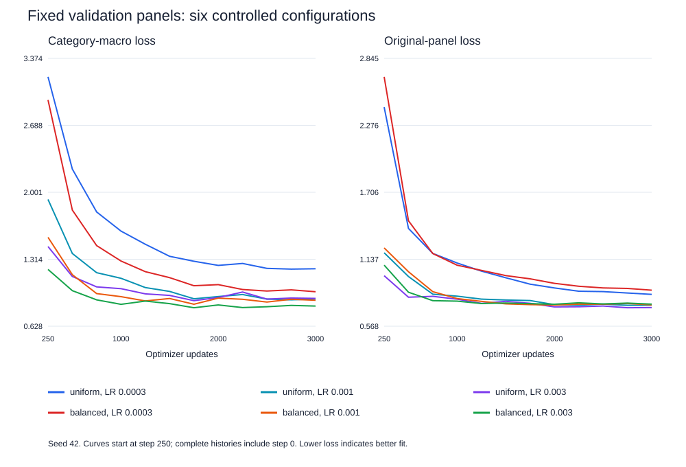

# Controlled tuning study

The expanded corpus, vocabulary, split, and architecture were held fixed. Six configurations were screened at seed 42. Selection used final category-macro validation loss with a 5% original-panel guardrail. The chosen setting and baseline were repeated at seeds 43 and 44 before loading the language suite.

Selected configuration: **balanced_lr0.003**. The three category losses each average non-padding token losses within their panel, then receive equal weight. The balanced training batches contain exactly 16 starter, eight grammar, and eight contrast passages. Token counts vary by passage length.

| Sampler | Peak LR | Original loss | Grammar loss | Contrast loss | Macro loss | Eligible | Correct / 48 |
|---|---:|---:|---:|---:|---:|---|---:|
| uniform | 0.0003 | 0.838709 | 1.372893 | 1.532926 | 1.216935 | No | 24 |
| uniform | 0.001 | 0.746731 | 1.226820 | 0.789062 | 0.906704 | Yes | 24 |
| uniform | 0.003 | 0.726566 | 1.210648 | 0.822802 | 0.913143 | Yes | 24 |
| balanced | 0.0003 | 0.874261 | 1.085320 | 1.013715 | 0.981257 | No | 25 |
| balanced | 0.001 | 0.749250 | 1.054310 | 0.875585 | 0.893670 | Yes | 26 |
| balanced | 0.003 | 0.755719 | 1.061898 | 0.688812 | 0.834300 | Yes | 26 |

## Paired confirmation

| Seed | Baseline correct | Selected correct | Macro loss change | Original loss change | Guardrail | Gains | Regressions |
|---|---:|---:|---:|---:|---|---|---|
| 42 | 24 | 26 | -0.072404 | +0.008988 | Pass | lang_28, lang_29 | None |
| 43 | 25 | 25 | +0.051777 | +0.021596 | Pass | lang_21 | lang_22 |
| 44 | 26 | 25 | +0.027321 | +0.016163 | Pass | None | lang_28 |

Mean correct answers: baseline **25.00/48**, selected **25.33/48**. Mean paired macro-loss change: **+0.002231**. Coverage remains **27/48** in every run. Negative loss changes indicate improvement. Seeds 43 and 44 are confirmation runs; seed 42 was used for selection.

## A real update at step 1,000

Preselected training passage: `a gardener seems calm today .`. Prefix: `a gardener`. Target: `seems`. Tracked parameter: embedding row 225, coordinate 0. Input/output embeddings share this weight.

| Measurement | Before | After |
|---|---:|---:|
| Batch loss | 0.6528248191 | 0.6405624747 |
| Target probability | 0.9928501844 | 0.9925804138 |
| Original validation loss | 0.7800863981 | 0.7811573148 |
| Category-macro validation loss | 0.8533952435 | 0.8521275123 |
| Embedding coordinate | -0.2060003132 | -0.2053688616 |

- Actual learning rate: `0.0024088125601`; raw gradient: `-0.000110582019261`; clipped gradient: `-0.000110582019261`.
- Gradient norm: `0.443407833576`; clipping multiplier: `1`; actual coordinate change: `0.00063145160675`.
- Adam first moment: `-2.31193407672e-05` → `-3.18656093441e-05`; second moment: `1.51553862793e-08` → `1.5009035792e-08`.

AdamW carries moving averages of gradients and squared gradients. Bias correction and adaptive scaling determine the gradient contribution, while weight decay shrinks the existing weight. The float64 reconstruction below is compared with the actual float32 optimizer update; the complete checkpoint replay matches every resulting weight exactly. [PyTorch AdamW](https://docs.pytorch.org/docs/2.14/generated/torch.optim.AdamW.html).

```text
m_hat = m_after / (1 - 0.9^1000)
v_hat = v_after / (1 - 0.95^1000)
delta = -lr * 0.01 * weight_before - lr * m_hat / (sqrt(v_hat) + 1e-8)
formula delta = 0.000631451075072
actual delta  = 0.00063145160675
```

All weights were updated together. The before/after measurements describe that whole optimizer step. A single coordinate cannot establish the cause of the prediction change. The passage, token and coordinate were fixed before training; every run retains its update evidence, including unfavorable changes.

## Learning curves



## Verification and limits

- 96 checks passed. The original expanded baseline was reproduced bit for bit. An uninstrumented selected run reproduced both final weights and the complete loss history.
- Every saved final checkpoint was reevaluated and each recorded update was reconstructed from saved weights, optimizer moments, and its actual minibatch.
- Confidence is high in the saved measurements. Three seeds and small, template-sharing validation panels support limited conclusions about this corpus. Confidence in broader language transfer remains low.
- The 48 public cases are a development benchmark. Their scores were read after selection. Vocabulary limits scorable cases to 27; all other cases receive zero credit.
- The original five article errors remain in the fixed corpus. Source grouping and passage-level balance do not equal token-level balance.

## Next improvements

1. Broaden vocabulary using independent teaching material; measure coverage separately from accuracy.
2. Correct article errors and diversify grammar and contrast constructions in a new corpus version.
3. Hold out entire template families before further tuning to measure transfer beyond shared templates.
4. Extend training only where late validation curves continue to improve; preserve a separate selection set.
5. Consider model size or tokenization changes after these data and optimization checks, within assignment rules.

## Reproduce

Run `custom_llm_tuning.ipynb` from the repository root. It creates a new timestamped study directory, freezes its protocol, executes the sweep and confirmations, evaluates all candidates, and verifies the saved evidence. The original experiment ledger and artifacts are retained.
